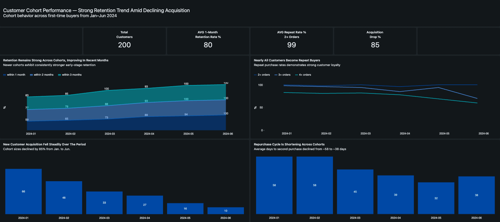

# **Cohort Analysis with Databricks and a Modern ELT Pipeline**

This repository contains the transformation logic, analytical models, and dashboard assets for a cohort analysis project built with a modern ELT architecture.  
The objective is to analyze customer retention, repeat purchase behavior, and time to second purchase across monthly customer cohorts.

---

## **1. Project Overview**

This project demonstrates how a modern analytics stack can be used end-to-end:

- **Cloud SQL (BigQuery)** as the source system
- **Fivetran** for automated ingestion
- **Databricks (Delta Lake + PySpark + SQL)** for transformations
- **Databricks Jobs** for orchestration
- **Databricks Dashboards** for visualization
- **GitHub** for version control and reproducibility

The underlying dataset covers **Jan–Dec 2024**, while all customers’ **first purchases occurred between January and June**, resulting in **six monthly cohorts**.

---

## **2. Objectives**

- Derive each customer’s **first** and **second** purchase dates
- Calculate:
  - Cumulative 1 / 2 / 3-month retention rates
  - Repeat purchase rates (2nd, 3rd, 4th orders)
  - Repurchase cycle (days until second order)
  - Cohort sizes (new customers per month)
- Model transformations using the **Medallion (Bronze–Silver–Gold) architecture**
- Automate execution via **Databricks Jobs**
- Build a dashboard for cohort-level behavioral insights

> **Interpretation Note**  
> Cohort sizes are small and no business context is available.  
> Results should be interpreted as **directional**, not statistically definitive.

---

## **3. ELT Data Stack**

The project follows a modern **ELT** paradigm:

1. **Extract** – Orders sourced from Cloud SQL
2. **Load** – Fivetran replicates raw data into Databricks (Bronze)
3. **Transform** – Databricks performs all modeling in Silver & Gold

**Why ELT?**

- Raw data is preserved
- Transformations are reproducible
- Logic scales as data volume grows
- Separation of concerns between ingestion and analytics

---

## **4. Medallion Architecture**

### **Bronze Layer – Raw Data**

- Stores raw order events replicated via Fivetran
- Minimal transformations (technical metadata only)

**PySpark model:**
- `bronze/bronze_ecom_orders.py`

---

### **Silver Layer – Customer-Level Features**

Transforms raw events into customer-centric features:

- First purchase date
- Second purchase date
- Days between first and second purchase
- Total order count per customer

This table serves as the **analytical backbone** for all cohort metrics.

**PySpark model:**
- `silver/silver_cohort_analysis.py`

**Equivalent SQL logic (reference only):**
- `sql/silver_cohort_analysis.sql`

---

### **Gold Layer – Cohort-Level Aggregations**

Aggregations consumed directly by the dashboard:

**PySpark models:**
- `gold/gold_retention_rate_by_cohort.py`
- `gold/gold_repeat_purchase_rate_by_cohort.py`
- `gold/gold_cohort_size_by_month.py`
- `gold/gold_time_to_second_purchase.py`

**Key metrics:**

- Monthly cohort assignment
- **Cumulative** retention within 1, 2, and 3 months
- Repeat purchase funnel (2+, 3+, 4+ orders)
- Cohort sizes
- Average & median time to second purchase

**SQL equivalents (documentation & validation):**
- `sql/gold_retention_rate_by_cohort.sql`
- `sql/gold_repeat_purchase_rate_by_cohort.sql`
- `sql/gold_cohort_size_by_month.sql`
- `sql/gold_time_to_second_purchase.sql`

---

## **5. Automation with Databricks Jobs**

All PySpark notebooks are orchestrated via a **Databricks Job** with explicit dependencies:

1. Bronze ingestion
2. Silver customer-level model
3. Gold aggregation models

This simulates a production-style batch pipeline and ensures deterministic execution order.

**Databricks Job DAG (screenshot):**

> 📌 *Insert screenshot here*  
> `dashboard/databricks_job_dag.png`

---

## **6. Dashboard**

A Databricks dashboard visualizes cohort behavior across multiple dimensions:

- High-level KPIs
- Retention trends by cohort
- Repeat purchase rates
- Cohort size trends
- Average days to second purchase

**Dashboard screenshot:**

---

## **7. Key Insights (from Dashboard)**

- Later cohorts show **stronger early-stage retention**
- Nearly all customers eventually place repeat orders
- Acquisition volume declines sharply over time
- Repurchase cycles appear to shorten in later cohorts

All retention metrics shown are **cumulative** (e.g. retained within 2 months).

---

## **8. Conclusions & Recommendations**

### **1 — Retention appears strong**
- Later cohorts exhibit higher early-stage retention
- May indicate improved onboarding, acquisition quality, or product–market fit

**Next step:**  
Review whether internal process or product changes occurred during the period

---

### **2 — Acquisition volume declines sharply**
- Could reflect seasonality, marketing shifts, or one-off effects
- With only six cohorts, no structural trend can be confirmed

**Next step:**  
Analyze acquisition channels, seasonality, and marketing spend

---

### **3 — Repurchase cycles may be shortening**
- Could indicate stronger engagement or improved customer experience
- Later cohorts have shorter observation windows, potentially biasing results

**Next step:**  
Validate with a longer time horizon and extended follow-up period

---

### **4 — Opportunity to strengthen analytics foundations**
- Pipeline is ready for automation and scaling
- Natural extension points exist

**Potential enhancements:**
- LTV modeling
- Churn prediction
- Behavioral segmentation (RFM / lifecycle cohorts)

---

## **9. Data Context & Limitations**

Several constraints should be considered when interpreting the results:

- **Limited cohort count:**  
  Only six monthly cohorts (Jan–Jun) are available.

- **Uneven observation windows:**  
  Later cohorts have had less time to generate repeat purchases, which may inflate early retention and shorten observed repurchase cycles.

- **Small and varying cohort sizes:**  
  Cohorts range from 10 to 66 customers, increasing sensitivity to outliers.

- **Cumulative retention metrics:**  
  Retention is calculated cumulatively (e.g. “within 2 months”), which can overstate perceived performance compared to discrete-period retention.

- **Missing business context:**  
  No information is available on:
  - Marketing channels or spend
  - Pricing or promotions
  - Product changes
  - Seasonality or customer segments

All insights should therefore be interpreted as **exploratory and directional**.

---

## **10. Repository Structure**

---

## **11. How to Run the Pipeline**

1. Connect the repository to Databricks
2. Execute the Databricks Job (or run notebooks sequentially):
   - Bronze → Silver → Gold
3. Refresh the Databricks dashboard
4. (Optional) Schedule the Job for recurring execution

---

## **12. Suggested Next Steps**

- Add incremental loads
- Parameterize jobs for multiple environments
- Extend Gold layer with LTV or churn metrics
- Integrate acquisition metadata for deeper analysis

---

## **6. Repository Structure**

- **bronze/**
  - [bronze_ecom_orders.csv](bronze/bronze_ecom_orders.csv)

- **silver/**
  - [silver_cohort_analysis.sql](silver/silver_cohort_analysis.sql)

- **gold/**
  - [gold_retention_rate_by_cohort.sql](gold/gold_retention_rate_by_cohort.sql)
  - [gold_repeat_purchase_rate_by_cohort.sql](gold/gold_repeat_purchase_rate_by_cohort.sql)
  - [gold_cohort_size_by_month.sql](gold/gold_cohort_size_by_month.sql)
  - [gold_repurchase_cycle.sql](gold/gold_repurchase_cycle.sql)

- **dashboard/**
  - [dashboard_screenshot.png](dashboard/dashboard_screenshot.png)

- **slides/**
  - [elt_databricks_project_cohort_analysis.pptx](slides/elt_databricks_project_cohort_analysis.pptx)
  - [elt_databricks_project_cohort_analysis.pdf](slides/elt_databricks_project_cohort_analysis.pdf)

## **7. Data Context & Limitations**

- Data covers the full year (Jan–Dec 2024)
- First purchases cluster exclusively in **Jan–Jun**, forming six cohorts
- Cohort sizes vary widely (10–66 customers)
- Unknown factors:
    - Marketing strategy
    - Industry or seasonality
    - Product and pricing context
    - Customer segments
- -> Insights should be viewed as **exploratory**, not conclusive.

---
